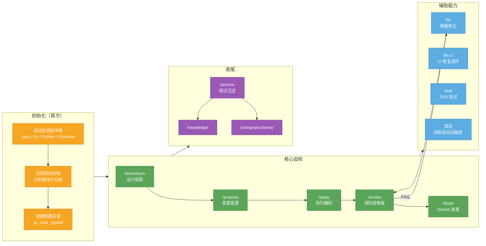

# ai-code-copilot

[English](README.md)

> **Context First, Harness Enables, Code Follows.** — 面向多技术栈软件项目的 AI 编码协作框架
>
> AI 让代码更容易生成，ai-code-copilot 让上下文、Harness 和反馈循环变得明确、可审查、可复用。

## 它是什么

ai-code-copilot 是一个兼容 **Codex** 与 **Claude Code** 的 AI 编码协作框架。它不直接写代码，而是帮你建立一套 **人机协作 Loop**：先搞清楚需求，再写规格说明，明确 Agent 能看见的测试、日志、规则和反馈入口，然后让 Agent 执行、验证、审查、归档。整个过程有文档沉淀、有质量门禁、有知识积累。

## 它解决了什么问题

| 传统 AI 辅助 | ai-code-copilot |
|-------------|----------------|
| 直接让 AI 改代码，需求、边界和验收散在聊天里 | Quick Card / Spec 先沉淀目标、范围、验收和风险，再动代码 |
| 每次会话都要重新摸索项目命令、架构和业务规则 | `/init` 将技术栈、构建/测试命令、架构和领域规则落到项目上下文 |
| 修完只剩一句“应该好了”，review 缺少可信证据 | 每个变更留下测试命令、日志入口、PR 证据和验证输出 |
| 踩坑只存在当次对话，类似需求下次还要从零开始 | `/archive` 将决策和坑沉淀为 knowledge；反复出现的经验升级成 rules、templates 或 packs |

## 核心特点

- **Spec 驱动** — Standard/Complex 没有 spec 不准写代码；Quick 没有 quick-card 不准写代码
- **项目级上下文** — `/init` 将技术栈、命令、架构和领域规则沉淀到 `.ai_code_copilot/`
- **Harness Engineering** — 用测试、日志、规则、review 和 knowledge 设计 Agent 可见反馈循环
- **Loop Engineering** — 每个变更声明简洁的 Goal Contract：Goal、Done Signal、Guardrails、Fallback、Memory
- **DDD-lite Domain Check** — 复杂业务变更记录 Language、Boundary、Invariants、State Transitions、Owner，不强制完整 DDD 结构
- **渐进式复杂度** — 自动判断 Quick / Standard / Complex 三档
- **规则分层** — core 只管 AI 协作流程，技术栈细节放在 Java/Go/Python/Frontend pack
- **上下文预算策略** — SessionStart 只注入 L0 安全和摘要；各命令按需加载 rules、packs 和 knowledge
- **双阶段审查** — 先查有没有按 spec 实现，再查代码质量
- **知识飞轮** — 每个项目的经验沉淀成知识库，AI 自动加载
- **全程可审计** — Quick Compact 在 `quick-card.md` 留证；其他模式使用 `log.md` 和摘要
- **安全红线** — 资金/权限/状态变更必须人工确认

Harness Engineering 和 Loop Engineering 的框架内定义见 [`docs/harness-engineering.md`](docs/harness-engineering.md) 与 [`docs/loop-engineering.md`](docs/loop-engineering.md)。

## 规则分层

ai-code-copilot 不把所有语言规则揉成一套。通用流程和安全红线保留在 `rules/`，技术栈写法放进 `packs/`：

| 层级 | 负责什么 | 示例 |
|------|----------|------|
| Core rules | AI 怎么协作、如何验证、通用安全、GitHub 指标和领域边界 | `rules/coding-style.md`、`rules/security.md`、`rules/commit-convention.md`、`rules/github-metrics.md` |
| Tech pack | 这个技术栈怎么写代码、怎么测试、怎么分层 | `packs/java-spring/`、`packs/go/`、`packs/python/`、`packs/frontend-react/` |
| Project rules | 业务项目自己的架构、命令、领域规则 | `<project>/.ai_code_copilot/rules/` |

`/init` 会自动检测技术栈，复制 core rules 和命中的 pack rules 到项目级 `.ai_code_copilot/rules/`。

## 上下文管理

上下文预算策略拆成四层：

| 层 | 文件 | 职责 | 不负责什么 |
|----|------|------|------------|
| Hook | `hooks/hooks.json`、`hooks/session-start` | 唤醒框架、注入 L0 安全、提示 context 过期、展示 active change 摘要 | 命令级路由或加载 packs/knowledge |
| Prompt | `agents/copilot-prompt.md` | 定义每个命令什么时候加载什么上下文 | 维护机器状态 |
| Templates | `changes/templates/*.md` | 长期文档结构和 review gate | 运行时事实 |
| State | `.ai_code_copilot/.copilot-state.json` | 框架 commit、命中 packs、同步时间、context 新鲜度 | 用户工作流偏好 |

Quick Compact 的 SessionStart 状态来自经过校验的 `quick-card.md` metadata，其他模式使用 `summary.md`。当前模式对应的记录源缺失或字段不完整时，SessionStart 会给出 fallback 提示，具体命令阶段再读取完整变更文档。Log 压缩阈值放在 `.ai_code_copilot/config.json` 的 `logCompression` 下。建议安装 Python 3；没有 Python 时 hook 仍会注入 L0 安全规则，但会跳过 context freshness 和 active change 摘要。

**Codex 输入提示：** 在 Codex 里请用不带斜杠的命令名，例如 `finish <变更名>`、`archive <变更名>`，也可以直接说中文自然语言。不要输入 /archive，因为 Codex 客户端会先把它当成“归档当前会话”，ai-code-copilot 收不到这条消息；如果 `/finish` 被拦截或无效，也请改用 `finish <变更名>`。

## 全景图



## 渐进式复杂度

任务进来后，先判断规模，自动匹配流程：

| 档位 | 适用场景 | 流程 |
|------|----------|------|
| **Quick** | ≤1天，<5文件，不跨模块 | 说明范围 → quick-card → 确认 → 执行 → /review → /finish |
| **Standard** | 1-5天，或明确要求 | /brainstorm → /propose → /apply → /review → /finish |
| **Complex** | >5天，或跨 3+ 模块 | /brainstorm → roadmap → 拆子项目 → 每个走 Standard |

不确定时默认 Standard。

### Quick 记录模式与 Issue 合同

- **Quick Compact** 只适用于不超过 2 个文件、单一目的、单 commit，且不改 API/DB/依赖/CI/部署/generated artifact，不涉及安全、权限、认证、敏感信息、状态机或跨模块规则，并具备可执行验证与直接回滚的变更；`quick-card.md` 是唯一记录源。执行中任一条件不再满足时，必须自动升级为 Quick Full 后再继续。
- **Quick Full** 用于不满足或无法确认 Compact 条件的 Quick；记录集固定为 `quick-card.md` + `log.md` + `summary.md`。
- 需求开始时解析或只询问一次 `parentIssue`；存在时先读取整体需求，并在 GitHub 能力可用时把本次工作关联为 native sub-issue。
- Quick Card/Spec 确认后，必须自动创建唯一 `workIssue`；若已记录则校验并复用仍 open 的 `workIssue`。这是强制流程，不依赖配置。
- 分支严格使用 `type/scope`；commit 严格使用 `type(scope): description`。
- `/finish` 的 PR body 只用 `Closes #<workIssue>` 关闭工作 Issue；`parentIssue` 只允许 `Refs #<parentIssue>`，绝不由子变更关闭。
- `finishMode` 只控制 PR handoff（`ask`、`auto-pr`、`manual`）。旧 `issueWhenMissing` 已废弃并忽略。

---

## Standard 流程详解

日常开发中最常用的流程。以"新增订单取消接口"为例：

### 1. /brainstorm — 设计探索

**目的：先聊清楚再动手。**

```
你：我想加一个订单取消接口
AI：这个需求涉及哪些模块？是消费者取消还是管理员取消？
你：消费者取消
AI：取消需要检查订单状态吗？比如已发货的能取消吗？
你：只有待支付和已支付未发货可以
AI：好的，我来提两个方案...
```

- 每次只问一个问题，不连发多问
- 优先给选择题（2-3 选项 + 推荐 + 理由）
- 自动读取相关代码，找出现有实现
- 输出 `design-brief.md`（设计简报）

**硬性门控：design-brief 未确认，不准进入下一步。**

### 2. /propose — 变更提案

**目的：写规格说明书，明确改什么、怎么改。**

- 加载 design-brief 作为输入
- Research 相关代码链路（必须标注文件路径 + 类名/方法名）
- 先读 `knowledge/index.md`，按相关性打分，最多加载 5 条命中的知识文件
- 分三段生成文档，每段等你确认：
  - 代码现状 + 功能点清单
  - 变更范围 + 风险点
  - 技术决策 + 待澄清项
- 输出四个文件：
  - `spec.md` — 需求合同（要做什么）
  - `tasks.md` — 执行计划（精确到文件路径和函数签名）
  - `test-spec.md` — 测试策略草案（P0/P1/P2 + 验证命令）
  - `log.md` — 过程记录
  - `summary.md` — 给 SessionStart 和后续命令使用的轻量变更摘要

**硬性门控：spec 和 tasks 未确认，不准开始编码。**

### 3. /apply — 执行编码

**目的：按 spec 逐个 task 写代码，每步有证据验证。**

- 严禁无票开发：spec/quick-card 必须记录关联 Issue ID 或 URL
- 逐 task 执行（也可说"批量跑"）
- 每个 task 完成后必须展示：编译输出 / 测试输出 / curl 结果
- 禁止"应该没问题"等无证据声明
- 实时写入 log.md（决策、踩坑、知识发现）
- 自动 git commit：`feat(scope): 中文简述` / `fix(scope): 中文简述`

**Git 规范：** 分支严格使用 `type/scope`；commit message 严格使用 `type(scope): description`。Issue 信息放在正文或 PR。

**PR 规范：** PR 必须使用 `Closes #<workIssue>` 关闭工作 Issue，存在父级时使用 `Refs #<parentIssue>` 引用，并触发 CodeQL 静态审查与 CI 编译自动化审查。PR 信息按 `.github/PULL_REQUEST_TEMPLATE.md` 填写，便于 GitHub 统计 issue、测试、CI 和风险数据。

### 4. /review — 双阶段审查 + GitHub Readiness

**阶段一：Spec Compliance** — 逐条对比 spec.md 和实际代码
**阶段二：Code Quality** — 审查代码质量（Critical / Important / Minor）
**阶段三：GitHub Readiness** — 检查 Issue、PR body、测试证据、CI/CodeQL 和指标口径是否可被 GitHub 干净统计

Spec Compliance 或 Code Quality 任一阶段 FAIL → 回到 /fix → 修完再审。GitHub Readiness 若为 NEEDS_INFO → 补齐 PR/CI/测试证据后再审。审查通过后可执行 `/finish` 做 GitHub 收尾。

当 `log.md` 超过压缩阈值时，`/review` 或 `/fix` 可将过程性细节移动到 `log.archive.md`，但 commit hash、验证证据、review FAIL 原因和人工接受风险必须保留在当前 log。

### 5. /fix-ci — CI 失败修复闭环

当 GitHub Actions、CodeQL、lint、类型检查、单测或编译失败时，粘贴完整日志或提供 workflow run URL。AI 会先识别失败命令，尽量本地复现，再做最小修复，重新运行失败命令，并把根因、验证输出和 commit 写入 log.md。

### 6. /finish — GitHub 收尾

**目的：验证、push、创建 PR，并只用 `Closes #<workIssue>` 关闭工作 Issue。**

- 在 Codex 中请用 `finish <变更名>`、`开 PR <变更名>` 或自然语言触发，不依赖 `/finish` slash 命令
- 默认读取 `.ai_code_copilot/config.json` 的 `githubWorkflow`
- 缺配置时首次触发会询问并写入配置
- `finishMode=ask` 每次执行前确认，`auto-pr` 自动 push + PR，`manual` 只输出命令和 PR body；三者只控制 PR handoff，不控制 Issue 创建
- PR body 自动包含 Summary、Test Evidence、Risk、AI Collaboration、`Closes #<workIssue>`，有父 Issue 时再加 `Refs #<parentIssue>`
- Quick Compact 的收尾结果回填 `quick-card.md`；Quick Full 把收尾证据写入 `log.md`，并将 `summary.md` 更新为 `status: finished`；Standard/Complex 使用完整记录集
- Quick Compact 不要求 `log.md` 或 `summary.md`
- 如果 `log.md` 中存在 `Knowledge candidates`，询问是否现在写入 `knowledge/`、跳过，或继续归档
- Complex 子项目在 `/finish` 时生成 `log.summary.md`，下游会话不必等待 `/archive`

### 7. /archive — 知识沉淀

- 在 Codex 中请用 `archive <变更名>`、`归档 <变更名>` 或自然语言触发；不要输入 /archive，它是 Codex 客户端的“归档当前会话”命令
- 从 log.md 提取知识条目
- 逐条确认是否沉淀到 `knowledge/`
- 变更目录移至 `changes/archives/`
- 下次新需求，相关知识自动加载
- `/archive` 是推荐的清理和知识飞轮路径，但 `summary.md`、Complex `log.summary.md` 这类运行时依赖会在归档前就绪

---

## 命令速查

| 命令 | 自然语言触发 | 一句话 | 产出 |
|------|-------------|--------|------|
| `/init` | 初始化项目、分析工程结构、setup | 自动识别你的项目，配置协作环境 | `.ai_code_copilot/` 目录 |
| `/brainstorm` | 先讨论一下、帮我分析方案、设计探索、方案对比 | 先聊清楚再动手，避免写错方向 | `design-brief.md` |
| `/propose` | 帮我实现、加功能、加接口、优化、重构 | 写规格说明书，明确改什么、怎么改 | `spec.md` + `tasks.md` |
| `/apply` | 开始写代码、继续执行 | 按合同逐个 task 编码，每个都有证据验证 | Quick Compact：代码 + `quick-card.md`；Quick Full/Standard/Complex：代码 + `log.md`/`summary.md` |
| `/review` | 帮我看看代码、review 一下 | 先查有没有按 spec 实现，再查代码质量 | 审查报告 |
| `/fix` | 修 bug、改一下 xxx、排查问题 | review 发现问题就修，修完再审 | 修复代码 |
| `/fix-ci` | CI 报错、Actions 失败、流水线失败、修 CI | 基于 CI 日志做最小修复，并验证失败命令重新通过 | 修复代码 + `log.md` |
| `/finish` | 完成收尾、开 PR、发 PR | 验证、push、创建 PR，关闭 `workIssue` 并引用 `parentIssue` | PR + 当前模式记录源 |
| `/test` | 写测试、补单测、跑测试、测覆盖率 | Red/Green 循环，覆盖率 ≥ 80% | 测试用例 |
| `/archive` | 归档、沉淀知识、整理变更 | 把踩过的坑沉淀成知识，下次自动加载 | `knowledge/` |

---

## 设计原则

1. **头脑风暴先行**：复杂需求先用 /brainstorm 对齐方向，再写 spec，避免方向跑偏
2. **规格锁定**：编码前生成并确认 spec.md，需求不明确不动手
3. **硬性门控**：spec 未确认拒绝编码；/review 未检测到 /apply 提交拒绝执行
4. **渐进式复杂度**：按任务规模自动匹配 Quick / Standard / Complex 三档
5. **两阶段评审**：spec-reviewer 审需求合规，code-quality-reviewer 审代码质量，职责隔离
6. **完成即验证**：/fix、/apply 完成后必须展示编译和测试输出，禁止无证据声明"好了"
7. **GitHub 可统计**：/finish、PR 模板和 github-metrics 规则让 Issue、测试、CI、风险信息可被 GitHub/API/Actions 采集
8. **当前模式记录源**：Quick Compact 在 `quick-card.md` 维护过程、证据和 review 结论；Quick Full/Standard/Complex 使用 `log.md`/`summary.md`
9. **知识飞轮**：/finish 可提前捕获知识候选，/archive 仍是推荐的清理和深度沉淀路径

---

## 快速开始

```bash
# 自动安装（自动识别 Codex/Claude Code，注册 skill + hook）
curl -fsSL https://raw.githubusercontent.com/ting2tao/ai-code-copilot/main/install.sh | bash

# 指定安装到 Codex
curl -fsSL https://raw.githubusercontent.com/ting2tao/ai-code-copilot/main/install.sh | bash -s -- --codex

# 指定安装到 Claude Code
curl -fsSL https://raw.githubusercontent.com/ting2tao/ai-code-copilot/main/install.sh | bash -s -- --claude
```

安装完成后，在任意业务项目中打开 Codex 或 Claude Code，说：

```
/init
# 或“初始化项目”
```

> **更新：** 再次执行上面的 `curl ... | bash` 即可，脚本会自动 `git pull`。
>
> **手动安装：**
> ```bash
> git clone https://github.com/ting2tao/ai-code-copilot.git ~/.codex/ai_code_copilot
> bash ~/.codex/ai_code_copilot/install.sh --codex
> ```

### Windows 用户

在 **PowerShell** 中执行（需已安装 [Git for Windows](https://git-scm.com)）：

```powershell
irm https://raw.githubusercontent.com/ting2tao/ai-code-copilot/main/install.ps1 | iex
```

> 脚本使用目录 Junction 替代 symlink，无需开发者模式，也无需管理员权限。

**更新 / 卸载：**

```powershell
# 更新
powershell -ExecutionPolicy Bypass -File "$env:USERPROFILE\.codex\ai_code_copilot\install.ps1" -Codex

# 卸载
powershell -ExecutionPolicy Bypass -File "$env:USERPROFILE\.codex\ai_code_copilot\install.ps1" -Codex -Uninstall
```

---

## 目录结构

**全局层**（Codex 默认 `~/.codex/ai_code_copilot/`；Claude Code 默认 `~/.claude/ai_code_copilot/`）

```
ai_code_copilot/
├── install.sh              # macOS / Linux
├── install.ps1             # Windows (PowerShell)
├── agents/
│   ├── copilot-prompt.md       # 主提示词（skill 入口读取）
│   ├── spec-reviewer.md        # Spec 合规审查 Sub-Agent
│   └── code-quality-reviewer.md
├── hooks/
│   ├── hooks.json              # SessionStart hook 配置
│   └── session-start           # 每次会话自动注入安全规则
├── scripts/
│   ├── init_project.sh         # 脚本化 /init、--sync、--upgrade、--dry-run
│   └── check_framework.sh      # 框架自检
├── skill/
│   └── SKILL.md                # Codex/Claude Code skill 注册文件
├── packs/
│   ├── java-spring/            # Java/Spring 规则包
│   ├── go/                     # Go 规则包
│   ├── python/                 # Python 规则包
│   └── frontend-react/         # React/前端规则包
├── rules/                      # 跨语言通用规则（项目级可覆盖）
├── knowledge/                  # 全局知识库（/archive 写入）
└── changes/templates/          # 变更文档模板
```

**项目层**（`<project>/.ai_code_copilot/`）

```
.ai_code_copilot/
├── .copilot-state.json         # 框架版本、命中 pack、同步时间、project-context 新鲜度
├── config.json                 # 项目级工作流配置（如 /finish 策略）
├── rules/
│   ├── project-context.md      # 工程上下文（/init 生成）
│   ├── coding-style.md         # 项目编码规范（覆盖全局）
│   ├── commit-convention.md    # Issue / commit / PR 规范
│   ├── github-metrics.md       # GitHub 指标统计口径
│   └── domain-rules.md         # 业务约束（手动填写）
├── knowledge/
│   └── index.md                # 知识索引（/archive 维护）
└── changes/
    └── <变更名>/
        ├── quick-card.md       # Quick Compact 唯一记录源；Quick Full 也包含
        ├── log.md              # 仅 Quick Full/Standard/Complex
        ├── summary.md          # Quick Full/Standard/Complex 活跃摘要
        ├── design-brief.md     # Standard/Complex 的 /brainstorm 产出
        ├── spec.md             # Standard/Complex 需求合同
        ├── tasks.md            # Standard/Complex 执行计划
        └── log.archive.md      # 可选的压缩过程记录
```

---

## Hooks 机制

安装时自动向对应平台的 `settings.json` 注册 SessionStart Hook。每次打开 Codex/Claude Code 会话，只自动注入 L0 上下文，无需手动触发 skill：

- Standard/Complex 档：spec 未确认前禁止编码
- 涉及资金 / 状态流转 / 权限变更：强制高亮提醒
- 禁止硬编码密钥；禁止日志打印敏感信息
- 当 `.copilot-state.json` 显示 `project-context.md` 过期时软提醒执行同步
- 若只有一个进行中变更，Quick Compact 注入经校验的 `quick-card.md` metadata，其他模式注入 `summary.md`；完整文档、pack rules 和 knowledge 按需加载

---

## 初始化与同步

新项目或存量项目首次接入时，在业务项目根目录执行：

```bash
bash ~/.codex/ai_code_copilot/scripts/init_project.sh --project .
```

Codex/Claude 中说 `/init` 或“初始化项目”时，也会优先走这个脚本。它会自动检测 Java/Go/Python/Frontend pack，复制 core rules、命中的 pack rules 和 `changes/templates/`，并生成项目级 `project-context.md` 与 `.ai_code_copilot/config.json`。

框架后续升级后，**不会自动触碰业务项目**。需要同步新模板或新规则时显式执行：

```bash
bash ~/.codex/ai_code_copilot/scripts/init_project.sh --project . --sync
```

想先预览升级影响而不写文件：

```bash
bash ~/.codex/ai_code_copilot/scripts/init_project.sh --project . --upgrade --dry-run
```

同步策略：

- 缺失文件会直接补齐
- 已存在且内容相同的文件跳过
- `config.json` 是项目主权配置文件，已存在时保留项目内容，不生成 `.new`
- `rules/project-context.md` 和 `rules/domain-rules.md` 是项目主权文件，已存在时保留项目内容，不生成 `.new`
- `changes/templates/*.md` 是框架托管流程模板，已存在但内容不同则自动更新到新版
- 其他规则文件已存在但内容不同会写成 `<文件名>.new`，项目团队人工比较后决定是否合并
- `.ai_code_copilot/.copilot-state.json` 是机器维护的状态文件，会在非 dry-run 同步时刷新框架 commit、命中的 packs、初始化和同步时间
- `.copilot-state.json` 会记录 `projectContextSyncedAt`；SessionStart 会在过期时软提醒。默认阈值 30 天，可在 `.ai_code_copilot/config.json` 中用 `projectContextStaleAfterDays` 覆盖。
- `logCompression.reviewThresholdLines` 和 `logCompression.fixThresholdLines` 控制 `/review` 或 `/fix` 何时把过程记录压缩到 `log.archive.md`。

框架开发者可运行：

```bash
bash scripts/check_framework.sh
```

它会检查 pack manifest、规则文件引用、模板、安装脚本语法，并用 `tests/fixtures/` 验证 Java/Go/Python/Frontend/Monorepo 的 pack 检测。

---

## 卸载

```bash
bash ~/.codex/ai_code_copilot/install.sh --codex --uninstall
```
