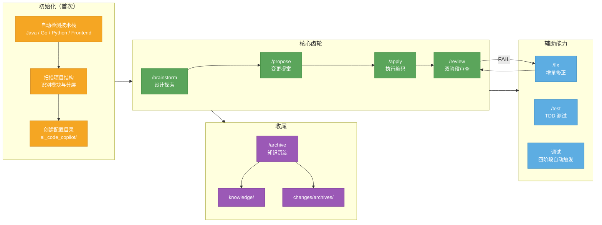

# ai-code-copilot

> **Code is Cheap, Context is Expensive** — 面向多技术栈软件项目的 AI 编码协作框架

## 它是什么

ai-code-copilot 是一个兼容 **Codex** 与 **Claude Code** 的 AI 编码协作框架。它不直接写代码，而是帮你建立一套 **人机协作规范**：先搞清楚需求，再写规格说明，最后按规格编码、审查、归档。整个过程有文档沉淀、有质量门禁、有知识积累。

## 它解决了什么问题

| 传统 AI 辅助 | ai-code-copilot |
|-------------|----------------|
| 直接让 AI 写代码，改了什么不清楚 | 先写 spec 再编码，变更全程可追溯 |
| AI 写完就完了，下次同样的坑再踩 | 知识自动沉淀，下次自动加载 |
| 审查靠人眼看，标准不统一 | 双阶段审查：需求合规 + 代码质量 |
| 改了一堆文件，不知道风险在哪 | 渐进式复杂度，小任务快跑，大任务拆解 |

## 核心特点

- **Spec 驱动** — Standard/Complex 没有 spec 不准写代码；Quick 没有 quick-card 不准写代码
- **渐进式复杂度** — 自动判断 Quick / Standard / Complex 三档
- **规则分层** — core 只管 AI 协作流程，技术栈细节放在 Java/Go/Python/Frontend pack
- **双阶段审查** — 先查有没有按 spec 实现，再查代码质量
- **知识飞轮** — 每个项目的经验沉淀成知识库，AI 自动加载
- **全程可审计** — 每次变更都有 log.md，记录决策、踩坑、review 结论
- **安全红线** — 资金/权限/状态变更必须人工确认

## 规则分层

ai-code-copilot 不把所有语言规则揉成一套。通用流程和安全红线保留在 `rules/`，技术栈写法放进 `packs/`：

| 层级 | 负责什么 | 示例 |
|------|----------|------|
| Core rules | AI 怎么协作、如何验证、通用安全和领域边界 | `rules/coding-style.md`、`rules/security.md` |
| Tech pack | 这个技术栈怎么写代码、怎么测试、怎么分层 | `packs/java-spring/`、`packs/go/`、`packs/python/`、`packs/frontend-react/` |
| Project rules | 业务项目自己的架构、命令、领域规则 | `<project>/ai_code_copilot/rules/` |

`/init` 会自动检测技术栈，复制 core rules 和命中的 pack rules 到项目级 `ai_code_copilot/rules/`。

## 全景图



## 渐进式复杂度

任务进来后，先判断规模，自动匹配流程：

| 档位 | 适用场景 | 流程 |
|------|----------|------|
| **Quick** | ≤1天，<5文件，不跨模块 | 说明范围 → quick-card → 确认 → 执行 → /review |
| **Standard** | 1-5天，或明确要求 | /brainstorm → /propose → /apply → /review |
| **Complex** | >5天，或跨 3+ 模块 | /brainstorm → roadmap → 拆子项目 → 每个走 Standard |

不确定时默认 Standard。

---

## Standard 流程详解

日常开发中最常用的流程。以"新增订单取消接口"为例：

### 1. /brainstorm — 设计探索

**目的：先聊清楚再动手。**

```
你：我想加一个订单取消接口
AI：这个需求涉及哪些模块？是消费者取消还是管理员取消？
你：消费者取消
AI：取消需要检查订单状态吗？比如已发货的能取消吗？
你：只有待支付和已支付未发货可以
AI：好的，我来提两个方案...
```

- 每次只问一个问题，不连发多问
- 优先给选择题（2-3 选项 + 推荐 + 理由）
- 自动读取相关代码，找出现有实现
- 输出 `design-brief.md`（设计简报）

**硬性门控：design-brief 未确认，不准进入下一步。**

### 2. /propose — 变更提案

**目的：写规格说明书，明确改什么、怎么改。**

- 加载 design-brief 作为输入
- Research 相关代码链路（必须标注文件路径 + 类名/方法名）
- 分三段生成文档，每段等你确认：
  - 代码现状 + 功能点清单
  - 变更范围 + 风险点
  - 技术决策 + 待澄清项
- 输出四个文件：
  - `spec.md` — 需求合同（要做什么）
  - `tasks.md` — 执行计划（精确到文件路径和函数签名）
  - `test-spec.md` — 测试策略草案（P0/P1/P2 + 验证命令）
  - `log.md` — 过程记录

**硬性门控：spec 和 tasks 未确认，不准开始编码。**

### 3. /apply — 执行编码

**目的：按 spec 逐个 task 写代码，每步有证据验证。**

- 逐 task 执行（也可说"批量跑"）
- 每个 task 完成后必须展示：编译输出 / 测试输出 / curl 结果
- 禁止"应该没问题"等无证据声明
- 实时写入 log.md（决策、踩坑、知识发现）
- 自动 git commit：`[变更名] 中文简述`

### 4. /review — 双阶段审查

**阶段一：Spec Compliance** — 逐条对比 spec.md 和实际代码
**阶段二：Code Quality** — 审查代码质量（Critical / Important / Minor）

任一阶段 FAIL → 回到 /fix → 修完再审。

### 5. /archive — 知识沉淀

- 从 log.md 提取知识条目
- 逐条确认是否沉淀到 `knowledge/`
- 变更目录移至 `changes/archives/`
- 下次新需求，相关知识自动加载

---

## 命令速查

| 命令 | 自然语言触发 | 一句话 | 产出 |
|------|-------------|--------|------|
| `/init` | 初始化项目、分析工程结构、setup | 自动识别你的项目，配置协作环境 | `ai_code_copilot/` 目录 |
| `/brainstorm` | 先讨论一下、帮我分析方案、设计探索、方案对比 | 先聊清楚再动手，避免写错方向 | `design-brief.md` |
| `/propose` | 帮我实现、加功能、加接口、优化、重构 | 写规格说明书，明确改什么、怎么改 | `spec.md` + `tasks.md` |
| `/apply` | 开始写代码、继续执行 | 按 spec 逐个 task 编码，每个都有证据验证 | 代码 + `log.md` |
| `/review` | 帮我看看代码、review 一下 | 先查有没有按 spec 实现，再查代码质量 | 审查报告 |
| `/fix` | 修 bug、改一下 xxx、排查问题 | review 发现问题就修，修完再审 | 修复代码 |
| `/test` | 写测试、补单测、跑测试、测覆盖率 | Red/Green 循环，覆盖率 ≥ 80% | 测试用例 |
| `/archive` | 归档、沉淀知识、整理变更 | 把踩过的坑沉淀成知识，下次自动加载 | `knowledge/` |

---

## 设计原则

1. **头脑风暴先行**：复杂需求先用 /brainstorm 对齐方向，再写 spec，避免方向跑偏
2. **规格锁定**：编码前生成并确认 spec.md，需求不明确不动手
3. **硬性门控**：spec 未确认拒绝编码；/review 未检测到 /apply 提交拒绝执行
4. **渐进式复杂度**：按任务规模自动匹配 Quick / Standard / Complex 三档
5. **两阶段评审**：spec-reviewer 审需求合规，code-quality-reviewer 审代码质量，职责隔离
6. **完成即验证**：/fix、/apply 完成后必须展示编译和测试输出，禁止无证据声明"好了"
7. **全程记录**：log.md 自动维护过程记录、知识发现、review 结论、遗留问题
8. **知识飞轮**：/archive 将项目经验沉淀到知识库，下次 /propose 自动加载

---

## 快速开始

```bash
# 自动安装（自动识别 Codex/Claude Code，注册 skill + hook）
curl -fsSL https://raw.githubusercontent.com/ting2tao/ai-code-copilot/main/install.sh | bash

# 指定安装到 Codex
curl -fsSL https://raw.githubusercontent.com/ting2tao/ai-code-copilot/main/install.sh | bash -s -- --codex

# 指定安装到 Claude Code
curl -fsSL https://raw.githubusercontent.com/ting2tao/ai-code-copilot/main/install.sh | bash -s -- --claude
```

安装完成后，在任意业务项目中打开 Codex 或 Claude Code，说：

```
初始化项目
```

> **更新：** 再次执行上面的 `curl ... | bash` 即可，脚本会自动 `git pull`。
>
> **手动安装：**
> ```bash
> git clone https://github.com/ting2tao/ai-code-copilot.git ~/.codex/ai_code_copilot
> bash ~/.codex/ai_code_copilot/install.sh --codex
> ```

### Windows 用户

在 **PowerShell** 中执行（需已安装 [Git for Windows](https://git-scm.com)）：

```powershell
irm https://raw.githubusercontent.com/ting2tao/ai-code-copilot/main/install.ps1 | iex
```

> 脚本使用目录 Junction 替代 symlink，无需开发者模式，也无需管理员权限。

**更新 / 卸载：**

```powershell
# 更新
powershell -ExecutionPolicy Bypass -File "$env:USERPROFILE\.codex\ai_code_copilot\install.ps1" -Codex

# 卸载
powershell -ExecutionPolicy Bypass -File "$env:USERPROFILE\.codex\ai_code_copilot\install.ps1" -Codex -Uninstall
```

---

## 目录结构

**全局层**（Codex 默认 `~/.codex/ai_code_copilot/`；Claude Code 默认 `~/.claude/ai_code_copilot/`）

```
ai_code_copilot/
├── install.sh              # macOS / Linux
├── install.ps1             # Windows (PowerShell)
├── agents/
│   ├── copilot-prompt.md       # 主提示词（skill 入口读取）
│   ├── spec-reviewer.md        # Spec 合规审查 Sub-Agent
│   └── code-quality-reviewer.md
├── hooks/
│   ├── hooks.json              # SessionStart hook 配置
│   └── session-start           # 每次会话自动注入安全规则
├── skill/
│   └── SKILL.md                # Codex/Claude Code skill 注册文件
├── packs/
│   ├── java-spring/            # Java/Spring 规则包
│   ├── go/                     # Go 规则包
│   ├── python/                 # Python 规则包
│   └── frontend-react/         # React/前端规则包
├── rules/                      # 跨语言通用规则（项目级可覆盖）
├── knowledge/                  # 全局知识库（/archive 写入）
└── changes/templates/          # 变更文档模板
```

**项目层**（`<project>/ai_code_copilot/`）

```
ai_code_copilot/
├── rules/
│   ├── project-context.md      # 工程上下文（/init 生成）
│   ├── coding-style.md         # 项目编码规范（覆盖全局）
│   └── domain-rules.md         # 业务约束（手动填写）
├── knowledge/
│   └── index.md                # 知识索引（/archive 维护）
└── changes/
    └── <变更名>/
        ├── design-brief.md     # /brainstorm 产出
        ├── spec.md             # 需求合同
        ├── tasks.md            # 执行计划
        └── log.md              # 过程记录 + 知识发现 + review 结论
```

---

## Hooks 机制

安装时自动向对应平台的 `settings.json` 注册 SessionStart Hook。每次打开 Codex/Claude Code 会话，安全规则自动注入，无需手动触发 skill：

- Standard/Complex 档：spec 未确认前禁止编码
- 涉及资金 / 状态流转 / 权限变更：强制高亮提醒
- 禁止硬编码密钥；禁止日志打印敏感信息

---

## 卸载

```bash
bash ~/.codex/ai_code_copilot/install.sh --codex --uninstall
```
