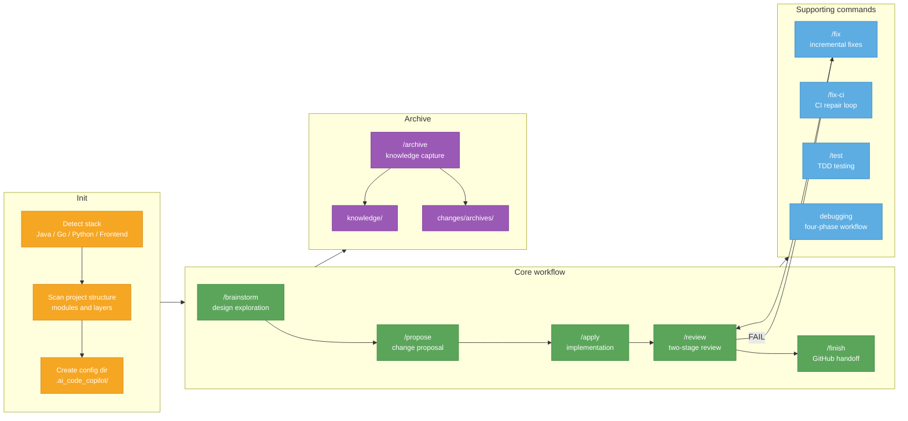

# ai-code-copilot

[中文说明](README-CN.md)

> **Context First, Harness Enables, Code Follows.** An AI coding collaboration framework for multi-stack software projects.
>
> AI makes code easier to generate. ai-code-copilot makes context, harnesses, and feedback loops explicit, reviewable, and reusable.

## What It Is

ai-code-copilot is an AI coding collaboration framework for **Codex** and **Claude Code**. It is not a runtime application. It installs prompts, rules, agents, hooks, templates, and scripts into `~/.codex/ai_code_copilot/` or `~/.claude/ai_code_copilot/`.

The framework helps you build a human-agent engineering loop: clarify the goal first, write a spec, define the tests/logs/rules/feedback that the agent can see, then let the agent execute, observe, tune, review, finish, and archive the change with evidence.

## Problems It Solves

| Typical AI assistance | ai-code-copilot |
|----------------------|-----------------|
| Ask AI to change code; requirements, boundaries, and acceptance stay scattered in chat | Quick Cards and Specs capture goals, scope, acceptance, and risks before code changes |
| Each session has to rediscover project commands, architecture, and domain rules | `/init` records stack detection, build/test commands, architecture, and domain rules as project context |
| A fix ends with "should work"; reviewers lack evidence to trust it | Each change leaves test commands, log entry points, PR evidence, and verification output |
| Lessons stay in the session; similar work starts from zero again | `/archive` turns decisions and pitfalls into knowledge; repeated lessons can become rules, templates, or packs |

## Core Features

- **Spec-driven work**: Standard/Complex changes require `spec.md`; Quick changes require `quick-card.md`.
- **Project-local context**: `/init` captures stack, commands, architecture, and domain rules in `.ai_code_copilot/`.
- **Harness Engineering**: tests, logs, rules, reviews, and knowledge form an agent-visible feedback loop.
- **Loop Engineering**: each change declares a compact Goal Contract: Goal, Done Signal, Guardrails, Fallback, and Memory.
- **DDD-lite Domain Check**: complex business changes record Language, Boundary, Invariants, State Transitions, and Owner without forcing a full DDD structure.
- **Progressive complexity**: Quick / Standard / Complex workflows based on change size and risk.
- **Layered rules**: core collaboration rules stay in `rules/`; stack-specific practices live in Java/Go/Python/Frontend packs.
- **Context-budget policy**: SessionStart injects only L0 safety and summaries; commands load rules, packs, and knowledge on demand.
- **Two-stage review**: first check implementation against the spec, then review code quality.
- **Knowledge flywheel**: project experience is archived into knowledge files and reused later.
- **Audit trail**: Quick Compact records evidence in `quick-card.md`; other modes use `log.md` and summaries.
- **Safety rails**: money, permission, and state-transition changes require human confirmation.

The framework definitions are in [`docs/harness-engineering.md`](docs/harness-engineering.md) and [`docs/loop-engineering.md`](docs/loop-engineering.md).

## Rule Layers

ai-code-copilot does not merge every language rule into one generic prompt. Common collaboration and safety rules live in `rules/`; stack-specific guidance lives in `packs/`.

| Layer | Responsibility | Examples |
|-------|----------------|----------|
| Core rules | Collaboration workflow, verification, common safety, GitHub metrics, domain boundaries | `rules/coding-style.md`, `rules/security.md`, `rules/commit-convention.md`, `rules/github-metrics.md` |
| Tech pack | How to code, test, and structure a specific stack | `packs/java-spring/`, `packs/go/`, `packs/python/`, `packs/frontend-react/` |
| Project rules | A business project's own architecture, commands, and domain rules | `<project>/.ai_code_copilot/rules/` |

`/init` detects the project stack and copies core rules plus matching pack rules into `.ai_code_copilot/rules/`.

## Context Management

The context-budget policy is split across four layers:

| Layer | Files | Responsibility | Not responsible for |
|-------|-------|----------------|---------------------|
| Hook | `hooks/hooks.json`, `hooks/session-start` | Wake the framework, inject L0 safety, warn about stale context, show active-change summaries | Command-level routing or loading packs/knowledge |
| Prompt | `agents/copilot-prompt.md` | Define what each command loads and when | Machine-maintained state |
| Templates | `changes/templates/*.md` | Long-lived document structure and review gates | Runtime facts |
| State | `.ai_code_copilot/.copilot-state.json` | Framework commit, matched packs, sync timestamps, context freshness | User workflow preferences |

For Quick Compact, SessionStart reads validated metadata from `quick-card.md`; other modes use `summary.md`. If the applicable source is malformed, SessionStart falls back to a warning and the command flow reads the full change documents later. Log compression thresholds are configurable in `.ai_code_copilot/config.json` under `logCompression`. Python 3 is recommended for the hook's JSON/date helpers; without it, the hook still injects L0 safety rules but skips freshness and active-change summaries.

**Codex input note:** type command names without a leading slash, such as `finish <change>` or `archive <change>`. 不要输入 /archive in Codex: the client treats it as "archive this session" before ai-code-copilot can handle it. If `/finish` is intercepted or ignored, use `finish <change>` instead.

## Workflow Map



## Progressive Complexity

Every request is classified before work begins:

| Level | When to use | Flow |
|-------|-------------|------|
| **Quick** | Less than one day, fewer than five files, no cross-module work | scope note -> quick-card -> confirmation -> implementation -> `/review` -> `/finish` |
| **Standard** | One to five days, or when explicitly requested | `/brainstorm` -> `/propose` -> `/apply` -> `/review` -> `/finish` |
| **Complex** | More than five days, or across three or more modules | `/brainstorm` -> roadmap -> split into Standard subprojects |

When uncertain, the framework defaults to Standard.

### Quick record modes and Issue contract

- **Quick Compact** is limited to a single-purpose, single-commit change touching at most two files, with no API, database, dependency, CI, deployment, generated-artifact, security, permission, authentication, sensitive-data, state-machine, or cross-module rule impact, and it must have executable verification plus direct rollback. It uses `quick-card.md` as its single record source. If any condition stops being true at runtime, it automatically upgrades to Quick Full before work continues.
- **Quick Full** is the default when Compact eligibility is uncertain or unmet. Its record set is `quick-card.md` + `log.md` + `summary.md`.
- At the start, the workflow parses or asks once for `parentIssue`, reads its overall requirement when present, and links the work as a native sub-issue when GitHub supports the relationship.
- After a Quick Card or Spec is confirmed, the workflow must automatically create one `workIssue`, or validate and reuse the recorded open `workIssue`. This is mandatory and does not depend on configuration.
- Branches must use `type/scope`; commits must use `type(scope): description`.
- `/finish` puts `Closes #<workIssue>` in the PR body. A `parentIssue` is referenced only with `Refs #<parentIssue>` and is never closed by the child change.
- `finishMode` controls only PR handoff (`ask`, `auto-pr`, or `manual`). The old `issueWhenMissing` setting is obsolete and ignored.

## Standard Workflow

The Standard flow is the common path for feature work. Example: "Add an order cancellation API."

### 1. `/brainstorm` - Design Exploration

Goal: clarify before implementation.

```text
You: I want to add an order cancellation API.
AI: Which actor cancels the order: customer or admin?
You: Customer.
AI: Should cancellation depend on order status, such as shipped or unpaid?
You: Only unpaid and paid-but-not-shipped orders can be cancelled.
AI: Good. I will compare two implementation options...
```

- Ask one question at a time.
- Prefer multiple-choice questions with a recommendation and reason.
- Read the relevant code and identify current behavior.
- Produce `design-brief.md`.

Hard gate: no confirmed `design-brief.md`, no `/propose`.

### 2. `/propose` - Change Proposal

Goal: write the contract for what will change and how.

- Load `design-brief.md` as input.
- Research the relevant code path with file/class/method references.
- Read `knowledge/index.md` first, score relevant entries, and load at most five matching knowledge files.
- Generate the proposal in three confirmation sections:
  - current code and feature list
  - change scope and risks
  - technical decisions and open questions
- Produce:
  - `spec.md`: requirement contract
  - `tasks.md`: implementation plan with file paths and function signatures
  - `test-spec.md`: P0/P1/P2 test strategy and verification commands
  - `log.md`: decision and evidence log
  - `summary.md`: lightweight active-change summary for SessionStart and later command loading

Hard gate: no confirmed spec and tasks, no implementation.

### 3. `/apply` - Implementation

Goal: implement task by task, with evidence after each step.

- No ticketless development: `spec.md` or `quick-card.md` must record an Issue ID or URL.
- Execute tasks one by one, or in a controlled batch when requested.
- After each task, show verifiable evidence such as build output, test output, or curl results.
- Avoid evidence-free claims such as "should be fine".
- Keep `log.md` updated with decisions, issues, and knowledge discoveries.
- Create commits such as `feat(scope): concise description` or `fix(scope): concise description`.

Branches use the strict `type/scope` form. Commit messages use the strict Conventional Commits form `type(scope): description`. Put Issue references in the body or PR.

PRs must use `Closes #<workIssue>` to close the work Issue and, when present, `Refs #<parentIssue>` for the parent. They must trigger CodeQL and CI and follow `.github/PULL_REQUEST_TEMPLATE.md` so GitHub can collect issue, test, CI, and risk data.

### 4. `/review` - Two-Stage Review and GitHub Readiness

Stage 1: **Spec Compliance** checks the implementation against `spec.md`.

Stage 2: **Code Quality** reviews safety, maintainability, readability, and test quality.

Stage 3: **GitHub Readiness** checks Issue linkage, PR body, test evidence, CI/CodeQL, and metric-friendly metadata.

If Spec Compliance or Code Quality fails, return to `/fix`, then review again. If GitHub Readiness is `NEEDS_INFO`, fill in PR/CI/test evidence before finishing.

When `log.md` grows past the compression threshold, `/review` or `/fix` can move process-only details to `log.archive.md` while keeping commit hashes, verification evidence, review failures, and accepted risks in the active log.

### 5. `/fix-ci` - CI Repair Loop

When GitHub Actions, CodeQL, lint, type checks, tests, or builds fail, paste the full log or provide a workflow run URL. The agent identifies the failed command, reproduces locally where possible, makes the smallest fix, reruns the failing command, and records root cause, verification output, and commit details in `log.md`.

### 6. `/finish` - GitHub Handoff

Goal: verify, push, create a PR, and close only the work Issue with `Closes #<workIssue>`.

- In Codex, trigger this flow with `finish <change>`, `open PR <change>`, or natural language instead of relying on `/finish`.
- Read `.ai_code_copilot/config.json` for `githubWorkflow`.
- Ask and write config on first use when missing.
- `finishMode=ask`: confirm each time.
- `finishMode=auto-pr`: push and create PR automatically.
- `finishMode=manual`: output commands and PR body only. These modes control PR handoff only, not Issue creation.
- PR body includes Summary, Test Evidence, Risk, AI Collaboration, `Closes #<workIssue>`, and, when present, `Refs #<parentIssue>`.
- Record finish results in `quick-card.md` for Quick Compact. Quick Full writes finish evidence to `log.md` and updates `summary.md` to `status: finished`; Standard/Complex use their full record set.
- Quick Compact does not require `log.md` or `summary.md`.
- If `Knowledge candidates` exist in `log.md`, ask whether to write them to `knowledge/` now, skip, or continue into archive.
- For Complex sub-projects, generate `log.summary.md` during `/finish` so downstream sessions can start without waiting for `/archive`.

### 7. `/archive` - Knowledge Capture

- In Codex, trigger this flow with `archive <change>` or natural language. 不要输入 /archive because Codex uses that slash command to archive the current session.
- Extract knowledge entries from `log.md`.
- Confirm each entry before writing it to `knowledge/`.
- Move the change directory to `changes/archives/`.
- Load relevant knowledge automatically in future proposals.
- `/archive` is the recommended cleanup and knowledge-flywheel path, but runtime dependencies such as `summary.md` and Complex `log.summary.md` are prepared before archive.

## Command Reference

| Command | Natural-language triggers | Purpose | Output |
|---------|---------------------------|---------|--------|
| `/init` | initialize project, analyze structure, setup | Detect the project and configure collaboration context | `.ai_code_copilot/` |
| `/brainstorm` | discuss first, analyze options, design exploration | Clarify direction before writing specs | `design-brief.md` |
| `/propose` | implement this, add feature, add API, optimize, refactor | Define what changes and how | `spec.md` + `tasks.md` |
| `/apply` | start coding, continue implementation | Implement task by task with verification evidence | Quick Compact: code + `quick-card.md`; Quick Full/Standard/Complex: code + `log.md`/`summary.md` |
| `/review` | review this, check code | Check spec compliance and code quality | review report |
| `/fix` | fix bug, change this, investigate issue | Fix review findings or bugs, then review again | code fix |
| `/fix-ci` | CI failed, Actions failed, fix CI | Repair CI failures with local reproduction where possible | code fix + `log.md` |
| `/finish` | finish, open PR, create PR | Verify, push, open PR, close `workIssue`, and reference `parentIssue` | PR + mode-specific record source |
| `/test` | write tests, add unit tests, run coverage | Red/Green testing with coverage gate | tests |
| `/archive` | archive, capture knowledge | Save lessons and archive the change | `knowledge/` |

## Design Principles

1. **Brainstorm first**: complex work starts with `/brainstorm` so the direction is aligned before specs.
2. **Spec lock**: generate and confirm `spec.md` before implementation.
3. **Hard gates**: no confirmed spec, no coding; no `/apply` evidence, no `/review` pass.
4. **Progressive complexity**: match Quick / Standard / Complex to the change.
5. **Two-stage review**: spec reviewer checks requirement compliance; code-quality reviewer checks implementation quality.
6. **Evidence before claims**: `/fix` and `/apply` must show build/test output before claiming success.
7. **GitHub-measurable work**: `/finish`, PR templates, and GitHub metrics rules make issues, tests, CI, and risk data collectible.
8. **Current-mode record source**: Quick Compact keeps decisions, evidence, and review results in `quick-card.md`; Quick Full/Standard/Complex use `log.md`/`summary.md`.
9. **Knowledge flywheel**: `/finish` can capture knowledge candidates early; `/archive` remains the recommended cleanup and deeper knowledge path.

## Quick Start

```bash
# Auto install; detects Codex or Claude Code and registers skill + hook.
curl -fsSL https://raw.githubusercontent.com/ting2tao/ai-code-copilot/main/install.sh | bash

# Install for Codex.
curl -fsSL https://raw.githubusercontent.com/ting2tao/ai-code-copilot/main/install.sh | bash -s -- --codex

# Install for Claude Code.
curl -fsSL https://raw.githubusercontent.com/ting2tao/ai-code-copilot/main/install.sh | bash -s -- --claude
```

After installation, open Codex or Claude Code in any business project and say:

```text
/init
# or say "初始化项目"
```

Update by running the same `curl ... | bash` command again. The installer will run `git pull`.

Manual install:

```bash
git clone https://github.com/ting2tao/ai-code-copilot.git ~/.codex/ai_code_copilot
bash ~/.codex/ai_code_copilot/install.sh --codex
```

### Windows

Run in **PowerShell** with [Git for Windows](https://git-scm.com) installed:

```powershell
irm https://raw.githubusercontent.com/ting2tao/ai-code-copilot/main/install.ps1 | iex
```

The Windows script uses a directory Junction instead of a symlink, so it does not require Developer Mode or administrator privileges.

Update or uninstall:

```powershell
# Update
powershell -ExecutionPolicy Bypass -File "$env:USERPROFILE\.codex\ai_code_copilot\install.ps1" -Codex

# Uninstall
powershell -ExecutionPolicy Bypass -File "$env:USERPROFILE\.codex\ai_code_copilot\install.ps1" -Codex -Uninstall
```

## Directory Structure

Global layer, installed by default at `~/.codex/ai_code_copilot/` for Codex or `~/.claude/ai_code_copilot/` for Claude Code:

```text
ai_code_copilot/
├── install.sh              # macOS / Linux
├── install.ps1             # Windows PowerShell
├── agents/
│   ├── copilot-prompt.md       # main prompt read by the skill entry
│   ├── spec-reviewer.md        # spec compliance reviewer sub-agent
│   └── code-quality-reviewer.md
├── hooks/
│   ├── hooks.json              # SessionStart hook config
│   └── session-start           # injects safety rules each session
├── scripts/
│   ├── init_project.sh         # scripted /init, --sync, --upgrade, --dry-run
│   └── check_framework.sh      # framework self-check
├── skill/
│   └── SKILL.md                # Codex/Claude Code skill registration
├── packs/
│   ├── java-spring/            # Java/Spring rules
│   ├── go/                     # Go rules
│   ├── python/                 # Python rules
│   └── frontend-react/         # React/frontend rules
├── rules/                      # cross-language common rules
├── knowledge/                  # global knowledge base written by /archive
└── changes/templates/          # change document templates
```

Project layer, created at `<project>/.ai_code_copilot/`:

```text
.ai_code_copilot/
├── .copilot-state.json         # framework version, matched packs, sync time, project-context freshness
├── config.json                 # project workflow config, such as /finish policy
├── rules/
│   ├── project-context.md      # project context generated by /init
│   ├── coding-style.md         # project coding style, overrides global
│   ├── commit-convention.md    # Issue / commit / PR rules
│   ├── github-metrics.md       # GitHub metric definitions
│   └── domain-rules.md         # domain constraints, filled manually
├── knowledge/
│   └── index.md                # knowledge index maintained by /archive
└── changes/
    └── <change-name>/
        ├── quick-card.md       # Quick Compact only record; also present in Quick Full
        ├── log.md              # Quick Full/Standard/Complex only
        ├── summary.md          # Quick Full/Standard/Complex active summary
        ├── design-brief.md     # Standard/Complex, produced by /brainstorm
        ├── spec.md             # Standard/Complex requirement contract
        ├── tasks.md            # Standard/Complex implementation plan
        └── log.archive.md      # optional compressed process notes
```

## Hooks

The installer registers a SessionStart hook in the matching platform `settings.json`. Each Codex or Claude Code session receives only L0 context automatically without manually invoking the skill:

- Standard/Complex: no coding before confirmed spec.
- Money, state-transition, or permission changes require explicit human confirmation.
- No hardcoded secrets; no sensitive data in logs.
- Optional project-context freshness warning when `.copilot-state.json` is older than the configured threshold.
- Optional active-change metadata when exactly one change is in progress: validated `quick-card.md` metadata for Quick Compact, otherwise `summary.md`.

## Initialization and Sync

For a new or existing business project, run from the project root:

```bash
bash ~/.codex/ai_code_copilot/scripts/init_project.sh --project .
```

When you say `/init` or "初始化项目" in Codex or Claude Code, the framework also prefers this script. It detects Java/Go/Python/Frontend packs, copies core rules, matched pack rules, and `changes/templates/`, then generates project-level `project-context.md` and `.ai_code_copilot/config.json`.

Framework upgrades do **not** automatically modify business projects. To sync new templates or rules into an already initialized project, run:

```bash
bash ~/.codex/ai_code_copilot/scripts/init_project.sh --project . --sync
```

Preview upgrade impact without writing files:

```bash
bash ~/.codex/ai_code_copilot/scripts/init_project.sh --project . --upgrade --dry-run
```

Sync policy:

- Missing files are created.
- Existing identical files are skipped.
- `config.json` is project-owned; existing content is preserved and no `.new` file is generated.
- `rules/project-context.md` and `rules/domain-rules.md` are project-owned; existing content is preserved and no `.new` file is generated.
- `changes/templates/*.md` are framework-managed; different existing files are updated to the new version.
- Other rule files with different content are written as `<filename>.new` for project teams to compare and merge manually.
- `.ai_code_copilot/.copilot-state.json` is machine-maintained and refreshed on non-dry-run sync.
- `.copilot-state.json` records `projectContextSyncedAt`; SessionStart warns when it is stale. Override the default 30-day threshold with `projectContextStaleAfterDays` in `.ai_code_copilot/config.json`.
- `logCompression.reviewThresholdLines` and `logCompression.fixThresholdLines` control when `/review` or `/fix` should compress process notes into `log.archive.md`.

Framework developers can run:

```bash
bash scripts/check_framework.sh
```

It checks pack manifests, rule references, templates, installer syntax, and pack detection against `tests/fixtures/` for Java/Go/Python/Frontend/Monorepo projects.

## Uninstall

```bash
bash ~/.codex/ai_code_copilot/install.sh --codex --uninstall
```
