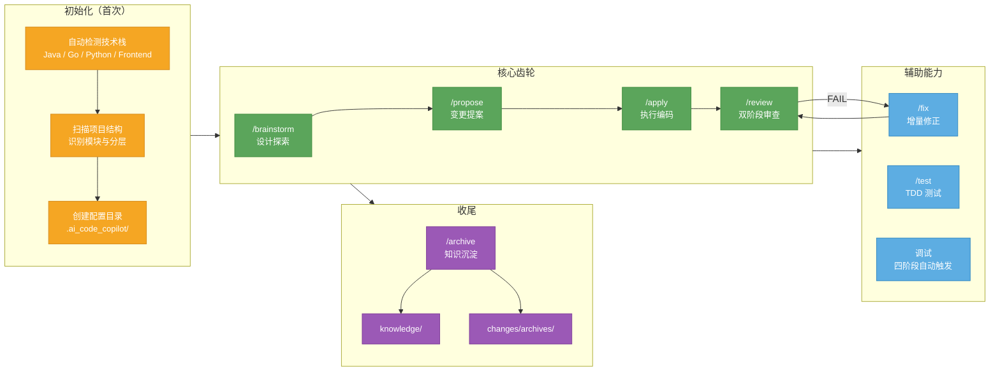

# ai-code-copilot — 业务项目使用全景图



## 渐进式 SDD 运行时

`skill/SKILL.md` 默认只加载 `agents/router.md`，路由器根据风险和交付生命周期按需读取 `agents/workflows/` 模块。单体 `agents/copilot-prompt.md` 只在模块缺失时作为严格兼容回退。

```text
Inline SDD  ->  Compact SDD  ->  Full SDD
     \-------------------------->
```

- **Inline SDD**：会话内 Goal/Scope/Done Signal/Verify，不落盘；只用于最多两文件、低风险、可直接回滚并有可执行验证的本地改动。
- **Compact SDD**：使用一个 `quick-card.md`；适合需要 commit/PR、跨会话、交接或可审计 review 的小改动。
- **Full SDD**：按风险使用 design/spec/tasks/test/log/summary；公共合同、数据库、安全、部署、跨模块规则、多目标和残余风险必须进入此档。
- 三档共用相同的安全和验证标准，只调整记录成本。升级单向且保留 previous contract、diff 和证据；旧 Quick/Standard/Complex 记录继续兼容。
- 新项目 `issuePolicy=on-publish`；旧项目缺少该字段时按 legacy `always`，项目配置不会被升级脚本静默改写。
- ai-code-copilot 是默认编排器；Superpowers 只作为显式调用的调试、验证、review、TDD、worktree 或并行专项库。

## 一分钟讲清楚

| 阶段 | 一句话 | 产出 |
| --- | --- | --- |
| **/init** | 自动识别你的项目，配置协作环境 | `.ai_code_copilot/` 目录 |
| **/brainstorm** | 先聊清楚再动手，避免写错方向 | `design-brief.md` |
| **/propose** | 写规格说明书，明确改什么、怎么改 | Standard/Complex：spec/tasks/test-spec；Quick Compact：仅 `quick-card.md`；Quick Full：`quick-card.md` + `log.md` + `summary.md` |
| **/apply** | 按合同逐个 task 编码，每个都有证据验证 | Quick Compact：代码 + `quick-card.md`；Quick Full：代码 + `log.md`；Standard/Complex：代码 + 完整记录集 |
| **/review** | 先查有没有按 spec 实现，再查代码质量 | 审查报告 |
| **/fix** | review 发现问题就修，修完再审 | 修复代码 |
| **/test** | Red/Green 循环，覆盖率 ≥ 80% | 测试用例 |
| **/archive** | 把踩过的坑沉淀成知识，下次自动加载 | `knowledge/` |

## Quick 与 GitHub 合同

- **Quick Compact**：仅限 ≤2 文件、单一目的、单 commit，无 API/DB/依赖/CI/部署/generated artifact、安全、权限、认证、敏感信息、状态机或跨模块规则影响，并具备可执行验证与直接回滚；`quick-card.md` 是唯一记录源。条件变化时自动升级为 Quick Full。
- **Quick Full**：Compact 条件不满足或无法确认时使用，记录集为 `quick-card.md` + `log.md` + `summary.md`。
- 开始时解析或询问 `parentIssue` 并读取整体需求；到达 `issuePolicy` 门禁后自动创建唯一 `workIssue`，或校验并复用已记录的 open work Issue。GitHub 支持时建立 native sub-issue。
- 分支固定为 `type/scope`，commit 固定为 `type(scope): description`。
- `/finish` 只用 `Closes #<workIssue>` 关闭工作 Issue；父级仅使用 `Refs #<parentIssue>`。
- `finishMode` 只控制 PR handoff。新项目 `issuePolicy` 默认 `on-publish`，旧配置缺失时使用 `always`；旧 `issueWhenMissing` 已废弃并忽略。
